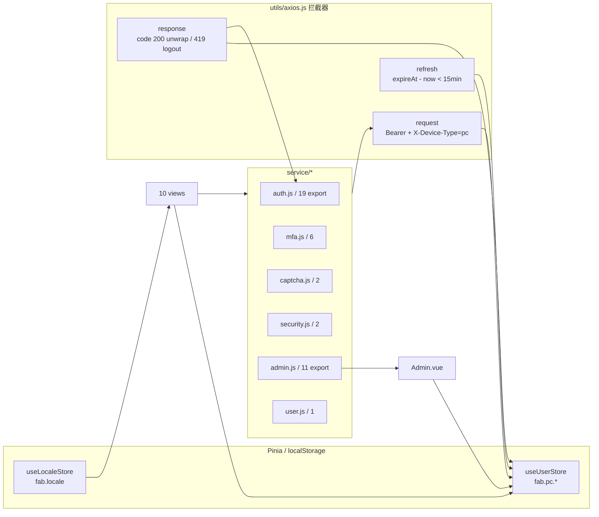

# Entities — fab-3d-world-pc

> Pinia stores schema + `api/types.ts` paths/components 摘要 + admin 表格 row 类型 + DTO 形状索引。
> 真相源：`src/stores/{user,locale}.js` + `src/api/types.ts`（codegen） + `src/components/admin/Admin*.vue`。
> 双端对等：`../fab-3d-world-web/.wiki/entities.md`（命名空间 `fab.web.*` vs `fab.pc.*`，其他字段同构）。

---

## 1. Store 实体关系图



---

## 2. `useUserStore` 完整 Schema

### 2.1 命名空间常量

```js
const NS = 'fab.pc'
const KEY_TOKEN  = 'fab.pc.token'
const KEY_USER   = 'fab.pc.user'
const KEY_EXPIRE = 'fab.pc.expireAt'
```

### 2.2 State

```ts
state: {
  token: string,         // 从 fab.pc.token 启动加载
  expireAt: number,      // ms 时间戳，0 = legacy 未知
  user: {
    userId?: number,
    id?: number,         // legacy 兼容
    username?: string,
    nickname?: string,
    avatar?: string,
    roles?: string[],    // 新字段（P1+）
    role?: string,       // legacy 字符串（兼容老登录响应）
    bindings?: Array<{
      provider: 'wechat-mp' | 'apple' | 'google' | 'github',
      boundAt?: string,
      externalUserId?: string,
      externalNickname?: string,
    }>,
  } | null
}
```

### 2.3 Getters 完整列表

| Getter | 实现要点 | 用途 |
|---|---|---|
| `isLoggedIn` | `!!token && (!expireAt \|\| expireAt > Date.now())` | router 守卫主判断；axios 注入 Bearer 时检查 |
| `roles` | `extractRoles(user)` — `Array.isArray(user.roles) ? user.roles : (typeof user.role==='string' ? [user.role] : [])` | 兜底 legacy |
| `hasRole(role)` | `roles.includes(role)` | 一对一 |
| `hasAnyRole([codes])` | 数组任一命中 | router `meta.requiresRoles` 用 |
| `isAdmin` | `roles.includes('admin') \|\| includes('super_admin')` | Admin sidebar / PcNavbar dropdown |
| `isSuperAdmin` | `roles.includes('super_admin')` | Roles 子 tab + 角色编辑入口 v-if |
| `isModerator` | `roles.includes('moderator')` | Admin §05 部分可见 |
| `isCreator` | `roles.includes('creator')` | 发布作品按钮等 |
| `isVerifiedUser` | `roles.includes('verified_user')` | 高级操作解锁（user-info 阶段使用） |
| `userId` | `user.userId ?? user.id ?? ''` | Admin role edit 自检 |
| `nickname` | `user.nickname \|\| user.username \|\| ''` | PcNavbar 显示 |
| `bindings` | `Array.isArray(user.bindings) ? user.bindings : []` | SettingsSecurity § OAuth |

### 2.4 Actions

| Action | 行为 |
|---|---|
| `login(token, user, expireAt)` | 写 state 三字段 + localStorage 三 key |
| `updateToken(token, expireAt)` | refresh 拦截器调，仅 token+expireAt |
| `updateUser(user)` | 拉到 `/user/info` 后回填整体 user |
| `setBindings(bindings)`（P5） | spread 旧 user 写入 `{...user, bindings}` 后 persist — **不可变**，不直接 mutate `user.bindings` |
| `logout()` | 清 state + 清三 localStorage key |

### 2.5 Legacy 迁移（首次启动一次性执行）

```text
old pc_token       → fab.pc.token
old pc_userInfo    → fab.pc.user
新 expireAt=0      → 触发 axios refresh 流程验证
旧 key 一律 removeItem（避免下次重复 migrate）
```

---

## 3. `useLocaleStore` Schema

```ts
state:   { current: 'zh-CN' | 'en-US' }
getters: { supported, isZh, isEn, elLocale (zhCn|en mjs 实例) }
actions: { setLocale(name), bootstrap() }
```

- `elLocale` getter 供 `<el-config-provider :locale>` 响应式订阅；切换时所有 `el-*` 组件自动重渲染。
- localStorage 通过 `i18n/detect.persistLocale` 持久化（key 由 detect 模块统一）。

---

## 4. 角色枚举（与后端 `RoleCode` 对齐）

| Code | 描述 | UI 影响 |
|---|---|---|
| `user` | 注册即得 | profile 可见，admin 拒绝 |
| `verified_user` | 双因素已验证（双绿升级） | 解锁高级操作 |
| `creator` | 已上传 ≥1 模型自动加 | 可发布作品 / 编辑模型 |
| `moderator` | 审核员 | `/admin` 部分入口（§05.1 Audit / 内容审核） |
| `admin` | 平台运营 | `/admin` 全入口（除 super_admin tab） |
| `super_admin` | 平台所有者 | + Roles 子 tab + Settings tab + Danger Zone |

`AdminRoleEditDialog.vue` 的 `ALL_ROLES` 常量必须与本表对齐（`['user','verified_user','creator','moderator','admin','super_admin']`）。

---

## 5. `api/types.ts`（codegen 产物）

由 `scripts/gen-api-types.mjs` 通过 `openapi-typescript` 生成（双端同源副本）。

### 5.1 当前状态（stub）

`src/api/types.ts` 目前是 codegen stub（来源 `/tmp/test-openapi.yaml`，header 注释自证），仅含：

```ts
export interface paths {
  '/auth/login/password': { post: operations['loginByPassword'] }
}

export interface components {
  schemas: {
    LoginRequest:  { identifier?: string; password?: string }
    CommonResult:  { code?: number; message?: string; data?: Record<string, never> }
  }
}
```

### 5.2 待真值

全量类型待运行 `npm run gen:api`（从 `../fab-3d-world-api/docs/openapi.yaml` 拉取）后会自动生成 P1-P6 全部 endpoint 的请求/响应/Schema。下文 §5.3 的 DTO 描述基于设计文档 §5 端点契约 + service 调用形态，**当前 api/types.ts 不含**，仅作"预期形状"参考。

### 5.3 设计预期 paths / schemas（基于 service 调用形态）

> 以下为 P1-P6 后端契约预期产物，仅作前端 service / view 调用时的类型参照。codegen 真值跑过 `npm run gen:api` 后以那为准。

```ts
// 预期 paths（覆盖 P1-P6 主端点）
export interface paths {
  '/auth/login/password': { post: operations['loginByPassword'] }
  '/auth/login/mfa-verify': { post: ... }
  '/auth/signup': { post: ... }
  '/auth/refresh': { post: ... }
  '/auth/password/change': { post: ... }
  '/auth/password/reset/{request,confirm}': { ... }
  '/auth/sessions': { get: ... }
  '/auth/sessions/{tokenValue}/revoke': { post: ... }
  '/auth/sessions/revoke-others': { post: ... }
  '/auth/oauth/{provider}/{authorize,callback,bind}': { ... }
  '/mfa/{setup,verify-setup,verify,disable,status,recovery-codes}': { ... }
  '/captcha/{config,verify}': { ... }
  '/admin/users': { get: 列表 ; ... /{id}/{ban,unban,roles,sessions/revoke-all} }
  '/admin/audit/login-events': { get: ... }
  '/user/info': { get: ... }
  '/user/security/alerts': { get: ... }
}

// 预期 schemas（service 调用形态推导，非现状）
export interface components {
  schemas: {
    LoginRequest          // { identifier, password, deviceType, captchaToken? }
    AuthLoginResponse     // { token, expireAt, user, requireMfa?, mfaToken? }
    AuthRefreshResponse   // { token, expireAt }
    SessionInfo           // { tokenValue, deviceType, ip, userAgent, loginAt, current }
    UserListItem          // { userId, username, phoneMasked, emailMasked, status, roles[], lastLoginAt }
    LoginEventVO          // { createdAt, userId, identifier, eventType, deviceType, ip, userAgent, failReason }
    RoleAssignmentRequest // { add: string[], remove: string[] }
    MfaSetupResponse      // { secret, qrUrl }
    MfaVerifySetupResponse // { recoveryCodes: string[10] }
    MfaStatus             // { enabled: boolean, recoveryRemaining: number }
    CaptchaConfig         // { provider, siteKey, required, enabled }
    AlertEvent            // { id, time, location, device, ip, ownership: 'self'|'unknown', userAgent? }
    CommonResult<T>       // { code: 200, message, data: T, traceId? }
  }
}
```

> 用法见 `docs/api-types.md`；service/*.js 仍用 JSDoc + `paths['...']`，待 codegen 拿到真值后再渐进迁移 `.ts`。

---

## 6. Admin 表格 Row 类型

### 6.1 `AdminUserMgmt.vue` Row（`UserListItem`）

| 字段 | 来源 | 显示 |
|---|---|---|
| `userId` | 后端 PK | 详情 + dialog key |
| `username` | `user_auth.username` | 第 1 列 |
| `phoneMasked` | 脱敏 `138****1234` | 第 2 列 |
| `emailMasked` | 脱敏 `lio***@gmail.com` | 第 3 列 |
| `status` | `NORMAL` / `BANNED` / `SUSPENDED` | 第 4 列 chip |
| `roles[]` | `user_role.role_code` 聚合 | 第 5 列 code chip |
| `lastLoginAt` | ISO string | 第 6 列 `YYYY-MM-DD HH:mm` |
| 操作列 | 派生：detail / editRoles (super_admin) / ban\|unban / revokeAll | 第 7 列按钮组 |

### 6.2 `AdminAuditTable.vue` Row（`LoginEventVO`）

| 字段 | 显示 |
|---|---|
| `createdAt` | `YYYY-MM-DD HH:mm:ss` |
| `userId` | 数字 |
| `identifier` | username/email/phone 实参 |
| `eventType` | `LOGIN_SUCCESS / LOGIN_FAIL / PASSWORD_RESET / ACCOUNT_LOCKED / BAN / REFRESH / LOGOUT` |
| `deviceType` | 小写 → toUpperCase 渲染 |
| `ip` | IPv4 string |
| `failReason` | string，非空时 chip |

> 关键事件 set：`{ ACCOUNT_LOCKED, PASSWORD_RESET, BAN }` 命中则整行高亮（红色背景 `color-mix(#b00020 8%)`）。

### 6.3 `PcSessionList.vue` Row（`SessionInfo`）

| 字段 | 用法 |
|---|---|
| `tokenValue` | revoke 按钮入参 |
| `deviceType` | `pc/web/mobile/desktop` → i18n device label |
| `ip` | 显示 |
| `userAgent` | 显示（缩略） |
| `loginAt` | `YYYY-MM-DD HH:mm` 格式化 |
| `current` | true 时 Current chip + Revoke disabled |

### 6.4 `AdminBanDialog` emit body

```js
{ reason: string,   // trim 后必填
  untilAt?: string  // ISO，未填则永久封禁 }
```

### 6.5 `AdminRoleEditDialog` emit body

```js
{ add: string[],     // 新选中但 initial 没有
  remove: string[] } // initial 有但新选未保留
// 客户端额外校验：checked.length >= 1 + 不可对自己 remove super_admin
```

---

## 7. Login 响应 / MFA 二段挑战

```ts
// 一段密码登录响应（两种形态）
type AuthLoginResponse =
  // 正常：拦截器 isAutoLoginEndpoint 命中 → store.login
  | { token: string, expireAt: number, user: User }
  // MFA 挑战：拦截器对 requireMfa 不写 store；前端切到 mfa step
  | { requireMfa: true, mfaToken: string }

// 二段验证
loginMfaVerify(mfaToken, code) → AuthLoginResponse（必然是正常形态）
```

`Login.vue:157-163` 判定逻辑：`data?.requireMfa && data?.mfaToken` → 走 `mfaStep=true`。

## 8. 错误响应（业务码 + 拦截器联动）

| code | 含义 | 拦截器动作 |
|---|---|---|
| `200` | 成功 | unwrap data |
| `419` | token 过期 | toast + logout + push `/login?from=...` |
| `401` | 未登录 | 同 419 |
| `429`（HTTP 真状态码） | 限流 | toast `auth.error.429` |
| `10301` | OAuth 绑定冲突 | OAuthCallback view 单独处理 toast |
| `10402` | MFA code 无效 | dialog 内吞，保留 step=1 |
| `requireCaptcha=true` field | 失败响应携带 → 前端拉新 captcha config + 强制开启 widget | Login.vue:167-181 |

完整 i18n 映射：`src/locales/zh-CN/auth.json` `error.<code>`。
