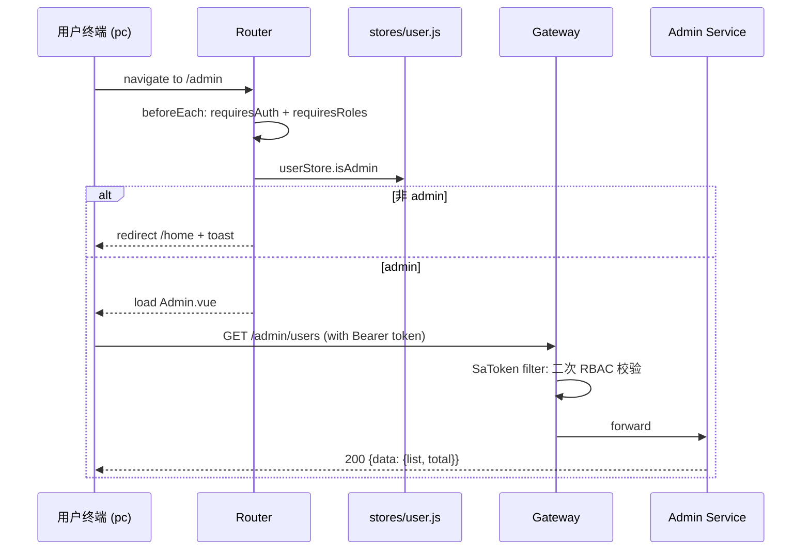

# Flows — fab-3d-world-pc

> 关键页面交互流（登录 / Admin RBAC / 表格分页 / refresh）。
> **状态**：Step 4 骨架版，AI 后续增量补全。

---

## TODO（首版后由 AI 增量填充）

- [ ] 登录流（与 web 同结构，DEVICE_TYPE='pc'）
- [ ] refresh 流（同 web，命名空间 fab.pc.*）
- [ ] Admin 路由守卫流（双层校验：前端 v-if + 服务端 SaToken filter）
- [ ] 用户管理 → 封禁流（ElMessageBox.confirm → service/admin.js → POST /admin/users/{id}/ban）
- [ ] 角色变更流（仅 super_admin → service → POST /admin/users/{id}/roles）
- [ ] 强制下线流（service → DELETE /admin/devices/{id}）
- [ ] 登录审计查看流（GET /admin/audit/login-events with pagination）
- [ ] ElTable 大数据虚拟滚动 + 排序 + 过滤组合

---

## 时序图模板：Admin RBAC

---

## 横切机制速查（PC 独有）

- **AdminSidebar 200px 侧栏**：6 section / 19 stab，v-model:active 切换
- **AdminStream 实时事件**：11 种 type 配色（详见 `utils/parseRich.js`）
- **危险操作二次确认**：`ElMessageBox.confirm({ type: 'warning' })` 统一封装到 `composables/useDangerConfirm.js`（待加）
- **视口降级**：window resize < 768px → 显示 "请在桌面端访问" 提示
- **居中布局**：>= 1920px content 居中不拉伸，侧栏可固定

---

Last reviewed: 2026-05-25 (Step 4 骨架)
