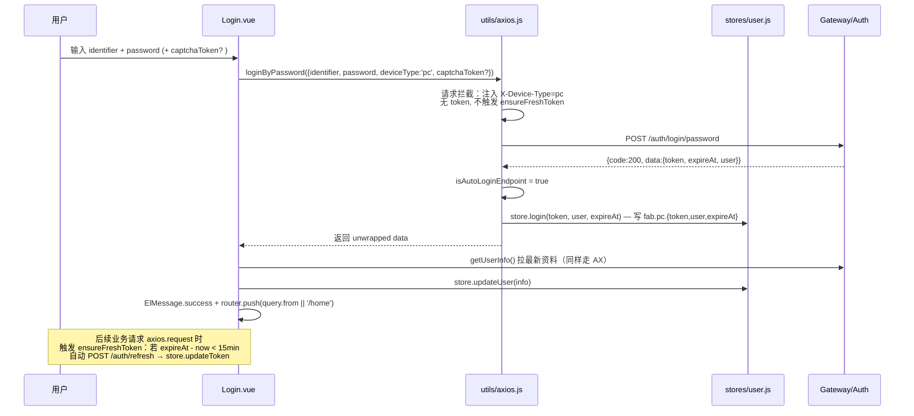
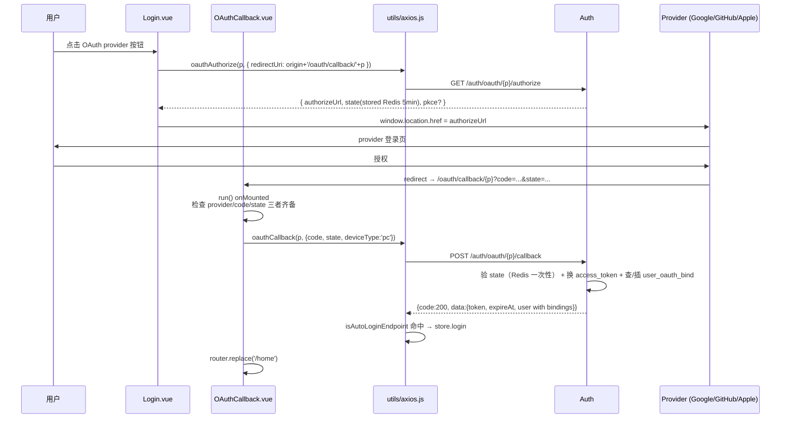
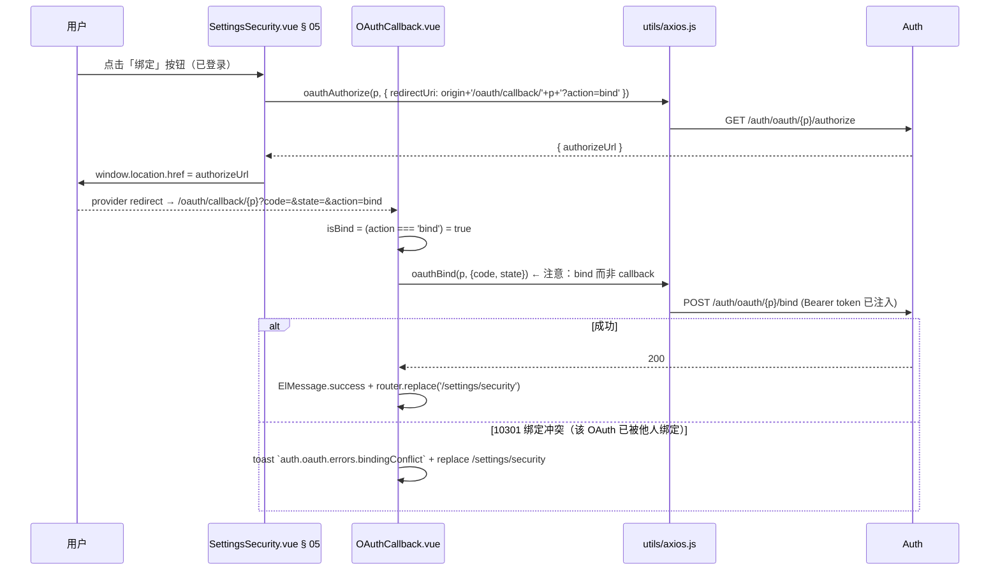
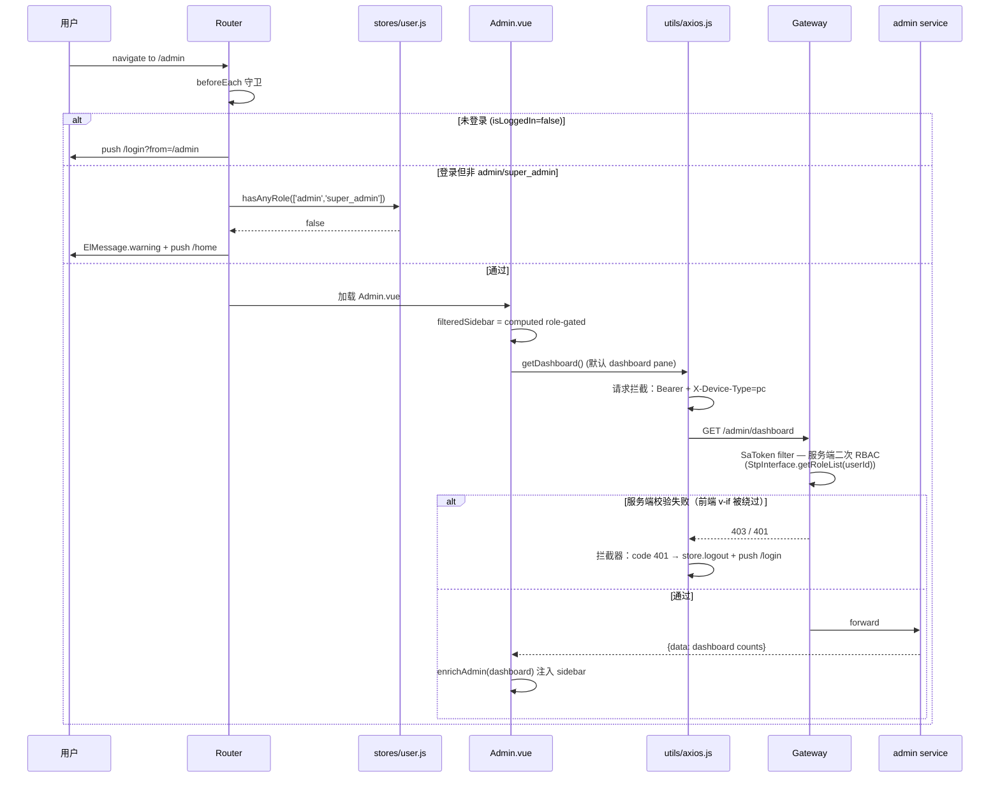
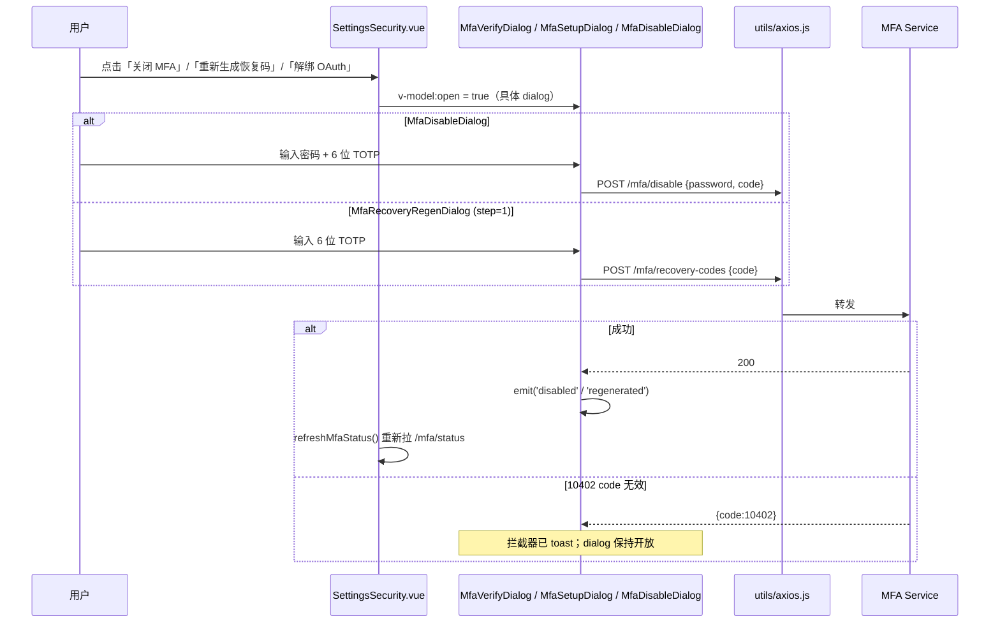
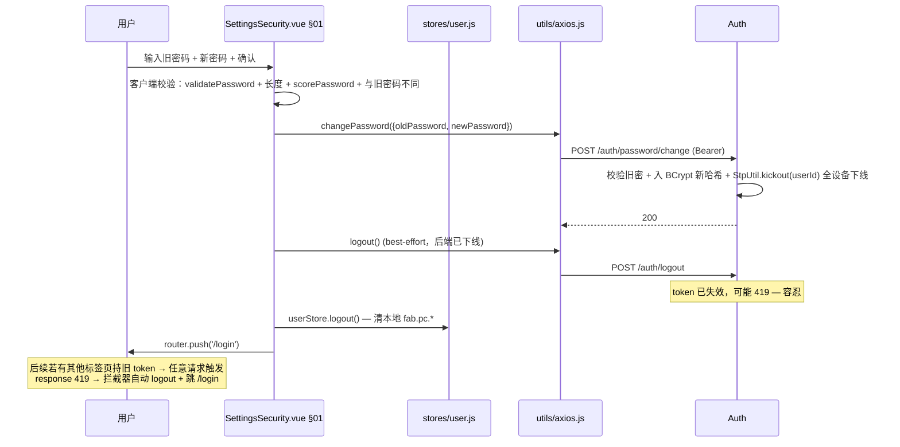
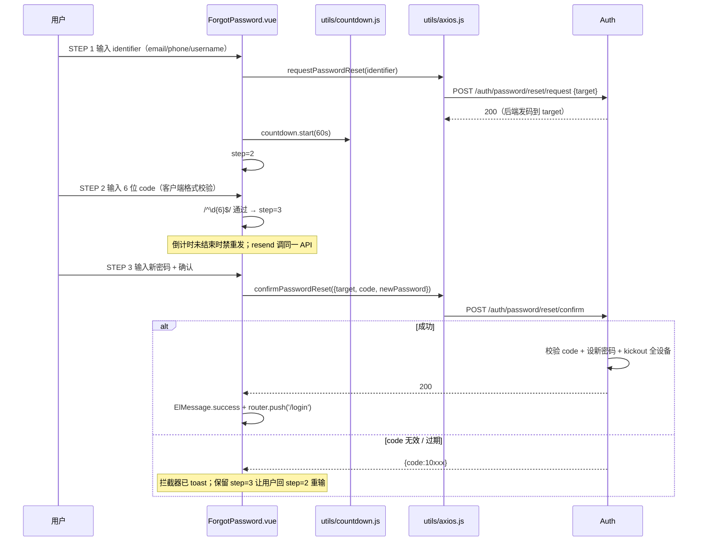
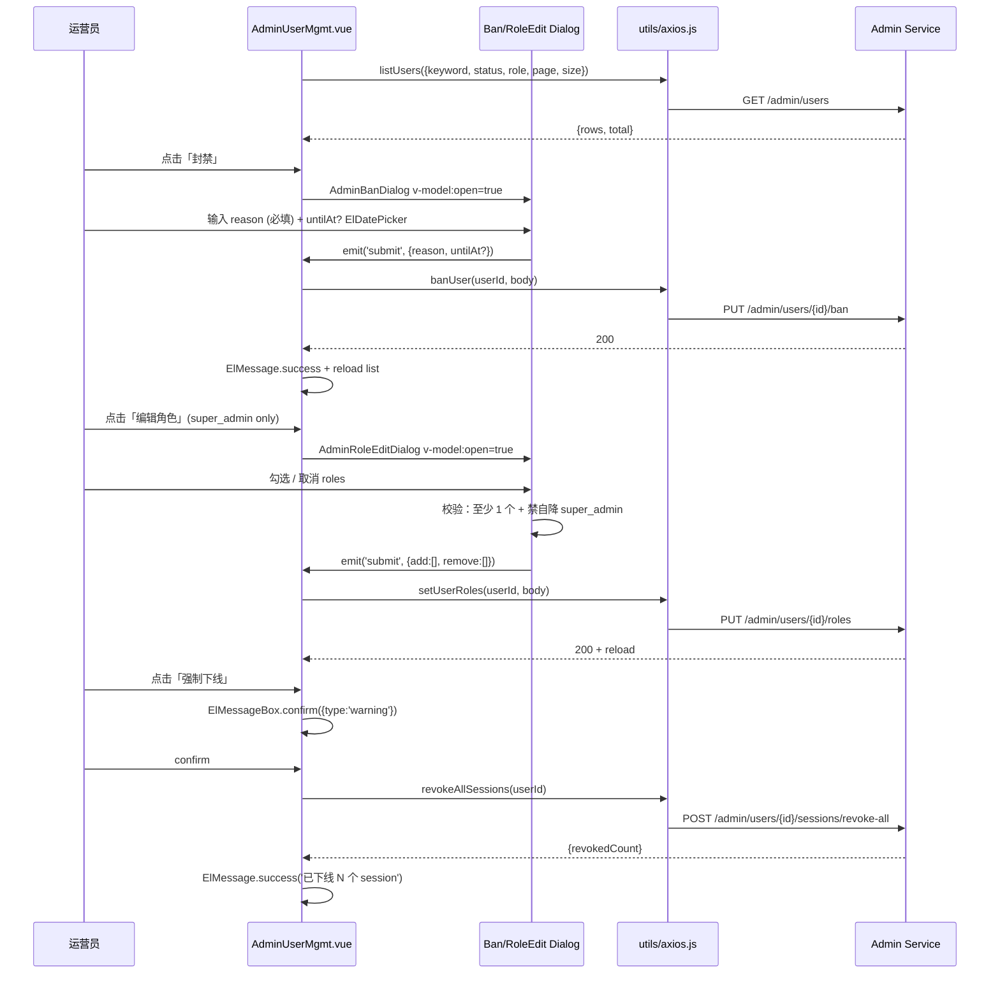

# Flows — fab-3d-world-pc

> 关键交互时序（user-auth P1-P6 全交付后版本）。真相源：`src/views/{Login,SettingsSecurity,Admin,OAuthCallback}.vue` + `src/utils/axios.js` + `src/router/index.js`。

---

## 1. 密码登录 + axios refresh 拦截器



---

## 2. MFA 二段登录（P6）

```mermaid
sequenceDiagram
  participant U as 用户
  participant V as Login.vue
  participant AX as utils/axios.js
  participant S as stores/user.js
  participant API as Auth

  U->>V: 输入密码 + 提交
  V->>AX: loginByPassword(payload)
  AX->>API: POST /auth/login/password
  API-->>AX: {code:200, data:{requireMfa:true, mfaToken}}
  AX->>AX: isAutoLoginEndpoint=true 但 data 无 token<br/>拦截器不写 store.login
  AX-->>V: 返回 data
  V->>V: mfaStep=true; mfaToken=data.mfaToken<br/>ElMessage.info('auth.login.mfaPrompt')
  U->>V: 输入 6 位 TOTP
  V->>AX: loginMfaVerify(mfaToken, code)
  AX->>API: POST /auth/login/mfa-verify
  alt 验证成功
    API-->>AX: {code:200, data:{token, expireAt, user}}
    AX->>S: store.login(...)
    V->>V: applyLoginResult → getUserInfo + push /home
  else 失败
    API-->>AX: {code:10402}
    AX-->>V: reject 业务错误（已 toast）
    Note over V: mfaStep 保持 true，等用户重输
  end
```

---

## 3. OAuth 登录跳转（P5，PC providers: google / github / apple）



错误分支：缺 code/state → toast `auth.oauth.errors.stateMismatch` → `/login?oauth_error=state_mismatch`。

---

## 4. OAuth 绑定流程（已登录态，`?action=bind`）



> SettingsSecurity 重渲染后通过 `userStore.bindings` 计算 isProviderBound → 按钮切「解绑」。
> 解绑：`oauthUnbind(p)` 成功后 `userStore.setBindings(filtered)` 不可变更新本地。

---

## 5. Admin RBAC 双层守卫（P4）



> 关键点：前端 `v-if="userStore.isSuperAdmin"` 只是 UX 优化（隐藏按钮），服务端 SaToken filter 才是真实安全边界。

---

## 6. 敏感操作 MFA 验证（P6 — 通用模式）



---

## 7. 改密 → kickout 全设备（P3）



---

## 8. 密码重置三步（P2）



---

## 9. AdminUserMgmt 列表 → 封禁/角色编辑/强制下线



---

## 10. 视图横切机制速查

- **AdminSidebar role-gated**：`filteredSidebar` computed 按当前用户 roles 过滤 sections / tabs（super_admin 注入 Roles 子 tab；moderator 只见 §05.1 Audit；Danger Zone 仅 super_admin）。
- **危险操作二次确认**：`ElMessageBox.confirm({type:'warning'})`（PC 标准），或 `ElPopconfirm`（settings/security 下线其他设备用）。
- **视口降级**：window resize < 768px 显示「请在桌面端访问」（部分页面）；登录 / forgot / oauth callback 不做降级。
- **居中布局**：admin-page width=1440px min-width=1440px（不响应式，专为桌面 1440+ 设计）。
- **AdminStream / Alert / Tickets 仍是 fixture**：M4 / M5 用户运营 / 客服模块上线时替换为真接口（spec backlog）。
