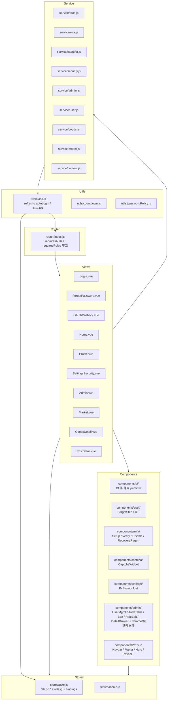

# Modules — fab-3d-world-pc

> Vue 3 + Element Plus 桌面端 + Ops Console（Admin）。
> 当前主线：user-auth P1-P6 主体已合并（PR #1，29 commits）+ 前期 Maker-Tech UI 重构 Phase 3-4。
> 同源对等：`../fab-3d-world-web/.wiki/modules.md`（双端 primitive / store / axios / i18n 同源）。

---

## 顶层组件拓扑



---

## 1. Views（10 个，全部走 Vue 3 + Composition API + `<script setup>`）

| 路径 | 路由 | 触发 P 阶段 | 关键依赖 |
|---|---|---|---|
| `Home.vue` | `/home` | — | PcNavbar / PcHeroCopy / PcMakerCard / PcFarmCard / cd-3 fixture |
| `Market.vue` | `/market` | — | PcNavbar / goods service / cd fixture |
| `GoodsDetail.vue` | `/goods/:id` | — | PcNavbar / goods service / viewerSoul（3D） |
| `PostDetail.vue` | `/post/:id` | — | PcNavbar / content service / parseRich |
| `Profile.vue` | `/profile`（requiresAuth） | — (user-info backlog) | PcProfileSidebar / PcAchievementCard / fixture（暂保留） |
| **`Login.vue`** | `/login` | P1 + P5 + P6 | UiFormChrome / UiFormSection / UiInput / loginByPassword / **loginMfaVerify** / **oauthAuthorize** / **CaptchaWidget** |
| **`ForgotPassword.vue`** | `/forgot-password` | P2 | UiFormChrome / ForgotStepIdentifier / ForgotStepCode / ForgotStepNewPassword / requestPasswordReset / confirmPasswordReset / useCountdown |
| **`OAuthCallback.vue`** | `/oauth/callback/:provider` | P5 | oauthCallback / oauthBind（含 `?action=bind` 分支） |
| **`SettingsSecurity.vue`** | `/settings/security`（requiresAuth） | P3 + P5 + P6 | PcSessionList / 改密 ElDialog / OAuth 绑定区 / **MfaSetupDialog** / **MfaDisableDialog** / **MfaRecoveryRegenDialog** / listAlerts |
| **`Admin.vue`** | `/admin`（requiresAuth + requiresRoles: admin/super_admin） | P4 | AdminNav / AdminSidebar(role-gated) / **AdminUserMgmt** / **AdminAuditTable** / fixture KPI/Stream/Alerts 保留 |

> Login.vue 关键代码点 `src/views/Login.vue:155-187`（密码登录 + MFA 二段 + captchaToken 注入）+ `src/views/Login.vue:203-219`（OAuth 起跳）。
> SettingsSecurity.vue 5 个 `<section>` 卡：§01 改密 → §02 设备 → §03 MFA → §04 安全预警 → §05 OAuth 绑定。
> Admin.vue 主区按 `activePane` 切换：users / audit / dashboard（fixture）。

---

## 2. Components — `components/ui/` 薄壳 primitive（13 件）

> Element Plus / 原生 input 都通过 ui/ 薄壳暴露，业务层禁直接 `import { ElXxx }`（chrome 级除外）。

| 文件 | 职责 |
|---|---|
| `UiAvatar.vue` | 圆方角 inline avatar，PcNavbar / Profile 用 |
| `UiButton.vue` | primary / secondary / ghost variant + badge slot + icon slot |
| `UiCard.vue` | 卡片骨架（含 num/name/stamp header） |
| `UiChip.vue` | 标签 chip |
| `UiFormChrome.vue` | Login / Forgot 表单顶条（chromeTitle + telemetry + back/right） |
| `UiFormField.vue` | label + hint + helper + slot fieldId，配套 UiInput |
| `UiFormSection.vue` | `§ NN · NAME · STAMP` section header |
| `UiIconButton.vue` | 方形图标按钮 |
| `UiInput.vue` | text/password/numeric 表单输入 + countdown + ibtn slot + submit 事件 |
| `UiPageTitle.vue` | 页面 H1 + 多行 subtitle |
| `UiReveal.vue` | motion-v 入场反复用（**双端同源副本**） |
| `UiSearchBar.vue` | 顶部搜索 + kbd（⌘K） |
| `UiSpecCard.vue` | spec 表格卡片，PostDetail / GoodsDetail 用 |

## 3. Components — `components/admin/`（user-auth P4 + 视觉壳 14 件）

| 文件 | 类型 | P4 角色 |
|---|---|---|
| `AdminNav.vue` | chrome | 顶部品牌条 + 操作员 ctx |
| `AdminTelemetry.vue` | chrome | live 数据条 |
| `AdminSidebar.vue` | chrome | role-gated 侧栏（filteredSidebar computed） |
| `AdminFooter.vue` | chrome | 底部版本 / 会话 / 快捷键 |
| `AdminKpiCard.vue` | 视觉壳 | KPI 四宫格 |
| `AdminCard.vue` | 视觉壳 | `§ N · TITLE · STAMP` 卡片骨架 |
| `AdminStream.vue` | 视觉壳（fixture） | 实时事件流（mock，dashboard pane） |
| `AdminAlert.vue` | 视觉壳（fixture） | 告警条目（mock） |
| `AdminTicketsTable.vue` | 视觉壳（fixture） | 工单表（mock） |
| **`AdminUserMgmt.vue`** | **真接口 P4** | `/admin/users` 列表 + ban / unban / 角色编辑入口（super_admin v-if） + 强制下线 / 详情入口 |
| **`AdminAuditTable.vue`** | **真接口 P4** | `/admin/audit/login-events` 多过滤（userId / type / from / to / device） + 关键事件高亮（ACCOUNT_LOCKED / PASSWORD_RESET / BAN） |
| **`AdminBanDialog.vue`** | **真接口 P4** | reason 必填 + untilAt 可选 ElDatePicker，emit submit |
| **`AdminRoleEditDialog.vue`** | **真接口 P4 super_admin only** | ALL_ROLES checkbox，校验至少 1 个 + 禁自降 super_admin，emit add/remove diff |
| **`AdminUserDetailDrawer.vue`** | **真接口 P4** | 显示 userId / createTime / lastLogin / activeSessions + 最近 login events（不显示 user-info 字段） |

> 关键代码点：`src/views/Admin.vue:45-78`（`filteredSidebar` role-gated computed） + `src/views/Admin.vue:87-93`（activePane 切换） + `src/components/admin/AdminUserMgmt.vue:309-325`（dialog v-model 装配）。

## 4. Components — `components/mfa/`（user-auth P6 — 4 件）

| 文件 | 端点 | 双步 |
|---|---|---|
| `MfaSetupDialog.vue` | `POST /mfa/setup` → `POST /mfa/verify-setup` | step=1 QR + secret + 6 位 code；step=2 10 个 recovery codes + ack |
| `MfaVerifyDialog.vue` | `POST /mfa/verify` | 通用「敏感操作前调」，emit verified |
| `MfaDisableDialog.vue` | `POST /mfa/disable` | 密码 + 6 位 code 双重 |
| `MfaRecoveryRegenDialog.vue` | `POST /mfa/recovery-codes` | step=1 验码；step=2 展示新 10 个 |

> `qrcode.vue` 依赖：用于 MfaSetupDialog 渲染 SVG QR（参数 size=180, level=M）。

## 5. Components — `components/captcha/`（user-auth P6）

- `CaptchaWidget.vue`：provider ∈ `mock | hcaptcha | turnstile`；mock checkbox emit token=`mock-pass`；hcaptcha/turnstile 占位 div（生产留接 JS SDK）。
- 被 `Login.vue` 在 `captchaCfg.required === true` 时渲染；error.requireCaptcha 失败后自动开启。

## 6. Components — `components/auth/`（user-auth P2 forgot 三步）

- `ForgotStepIdentifier.vue` — 输入 identifier，emit submit
- `ForgotStepCode.vue` — 输入 6 位 code + 60s 重发倒计时 prop
- `ForgotStepNewPassword.vue` — 新密码 + 确认 + scorePassword 强度提示

## 7. Components — `components/settings/`（user-auth P3）

- `PcSessionList.vue` — `GET /auth/sessions` 表格渲染，行内 Revoke 按钮 + 整批 revoke-others，Current chip 高亮当前 session。

## 8. Components — `components/Pc*.vue` 视觉 chrome（10 件）

`PcCtaStack` · `PcDetailStick` · `PcFileRow` · `PcFooter` · `PcLocaleSwitcher` · `PcNavbar` · `PcRelatedCard` · `PcSectionHeader` · `PcTelemetryStrip` · `PcViewerStage`。

> `PcNavbar` 是顶部 sticky 装配，所有 user-auth 视图（Login/Forgot 除外）都用它；含 user dropdown 菜单（profile / settings/security / admin / logout）。
> 子目录 `components/home/` 4 件 + `components/profile/` 4 件，纯视觉壳，未参与 user-auth。

## 9. Stores

| 文件 | 命名空间 | P 阶段 |
|---|---|---|
| `stores/user.js` | `fab.pc.*`（token / user / expireAt） | **P1 全量重写**（去 `pc_*` legacy + roles[] + isLoggedIn computed） + **P4 扩 5 个 role getter** + **P5 扩 bindings/setBindings** |
| `stores/locale.js` | localStorage `fab.locale` | 与 i18n bootstrap 耦合 |

### `stores/user.js` getters 全集（P1 → P5 演进）

| Getter | 实现 |
|---|---|
| `isLoggedIn` | `!!token && (!expireAt \|\| expireAt > now)` |
| `roles` | `extractRoles(user)` — 兼容 `user.roles[]` 新 + `user.role` legacy |
| `hasRole(code)` | `roles.includes(code)` |
| `hasAnyRole([codes])` | `codes.some(r => roles.includes(r))` |
| `isAdmin` | `roles.includes('admin') \|\| includes('super_admin')` |
| `isSuperAdmin` | `roles.includes('super_admin')` |
| `isModerator` | `roles.includes('moderator')` |
| `isCreator` | `roles.includes('creator')` |
| `isVerifiedUser` | `roles.includes('verified_user')` |
| `userId` / `nickname` | 兼容 `user.userId`/`id` + `nickname`/`username` |
| `bindings` | `Array.isArray(user.bindings) ? user.bindings : []` |

actions: `login(token,user,expireAt)` / `updateToken` / `updateUser` / **`setBindings(bindings)`**（P5） / `logout`。

## 10. Service

| 文件 | P 阶段 | 端点数 | 备注 |
|---|---|---|---|
| `service/auth.js` | P1 + P2 + P3 + P5 + P6 | 19 | 验证码 / 登录 / 注册 / refresh / 改密 / forgot / sessions / **oauthAuthorize/Callback/Bind/Unbind** / **loginMfaVerify**（其中 `login` 是 `loginByPassword` alias，OAuth 系列含 wrapper；对外实际后端端点数见 `cross-repo.md §2-3`） |
| `service/user.js` | P1 收敛 | 1 | 仅 `getUserInfo`（user-info 模块占位） |
| `service/mfa.js` | P6 | 6 | setup / verifySetup / verify / disable / status / regenerateRecoveryCodes |
| `service/captcha.js` | P6 | 2 | getConfig / verify |
| `service/security.js` | P6 | 2 | listAlerts / acknowledgeAlert |
| `service/admin.js` | P4 | 11 | dashboard / users CRUD / ban-unban / setRoles / revokeAllSessions / audit / posts / offlinePost / orders（对外实际端点数见 `cross-repo.md §7`） |
| `service/goods.js` | — | 4 | trade 商品 |
| `service/content.js` | — | 2 | content 帖子 |
| `service/model.js` | — | 2 | 3D model library |

详 endpoint × 调用点 → `cross-repo.md`。

## 11. Router（`router/index.js`）

```js
{ '/', '/home', '/post/:id', '/market', '/goods/:id',
  '/login', '/forgot-password', '/oauth/callback/:provider',          // P1 P2 P5
  '/profile' (requiresAuth),
  '/settings/security' (requiresAuth),                                 // P3
  '/admin' (requiresAuth + requiresRoles: ['admin','super_admin']) }   // P4
```

**`router.beforeEach` 守卫规则**：

1. 已登录访问 `/login` → 跳 `/home`（避重复登录）
2. `requiresAuth=true` + 未登录 → `/login?from=<fullPath>`
3. `requiresRoles` + `!hasAnyRole(meta.requiresRoles)` → ElMessage.warning(`common.toast.forbidden`) → 跳 `/home`
4. 否则放行

## 12. Utils

- `utils/axios.js` — **双端同源副本**（`fab.pc.*` + `X-Device-Type: pc` + ElMessage 通道）
  - 请求拦截：expireAt-now < 15min 自动 POST `/auth/refresh`（in-flight promise 去重）
  - 响应 code === 200 unwrap data；登录类端点（`AUTO_LOGIN_PATTERN`）自动 `store.login`
  - 响应 code 419/401 → logout + 跳 `/login?from=...`
  - error 429 → ElMessage `auth.error.429`
- `utils/countdown.js` — 通用倒计时 composable（forgot-password 重发用，**双端同源**）
- `utils/passwordPolicy.js` — `validatePassword` / `scorePassword` / `MIN_PASSWORD_LENGTH`（从 web port 同步）
- `utils/viewerSoul.js` — online-3d-viewer 注入（双端同源）
- `utils/parseRich.js` — 富文本（post）解析

## 13. 入口 / 主文件

- `src/main.js` — createApp + pinia + router + i18n bootstrap + `el-config-provider`
- `src/App.vue` — 单 `<router-view>` + `<el-config-provider :locale="localeStore.elLocale">`
- `vite.config.js` / `vitest.config.js` / `playwright.config.js` — 标准配置

## 14. 测试矩阵（Vitest 单测 + Playwright E2E）

| 类型 | 文件 | 覆盖 |
|---|---|---|
| 单测 | `src/utils/axios.spec.js` | refresh 触发 / unwrap / 419 跳登录 |
| 单测 | `src/utils/countdown.spec.js` | tick / reset |
| 单测 | `src/utils/passwordPolicy.spec.js` | validate / score |
| 单测 | `src/stores/user.test.js` | roles[] / hasAnyRole / migration legacy |
| 单测 | `src/service/*.spec.js` | 6 个 service 契约（auth / mfa / captcha / security / admin） |
| 单测 | `src/router/router.spec.js` | requiresAuth / requiresRoles |
| 单测 | `src/views/{Login,SettingsSecurity,Admin,OAuthCallback}.spec.js` | 关键交互 |
| 单测 | `src/components/{admin,mfa,settings,auth,captcha}/*.spec.js` | dialog + table primitive |
| E2E | `tests/e2e/login.spec.js` | golden path login |
| E2E | `tests/e2e/forgot-password.spec.js` | 三步 forgot |
| E2E | `tests/e2e/settings-security.spec.js` | 设备 / 改密 / OAuth |
| E2E | `tests/e2e/admin-rbac.spec.js` | admin / non-admin / super_admin 三 case（chromium pass） |
| E2E | `tests/e2e/oauth.spec.js` | OAuth 起跳 → callback mock |
| E2E | `tests/e2e/mfa.spec.js` | setup → verify → recovery |
| E2E | `tests/e2e/captcha-trigger.spec.js` | requireCaptcha 触发渲染 |

覆盖率门禁：line ≥ 80%；admin / auth 模块 ≥ 85%。
